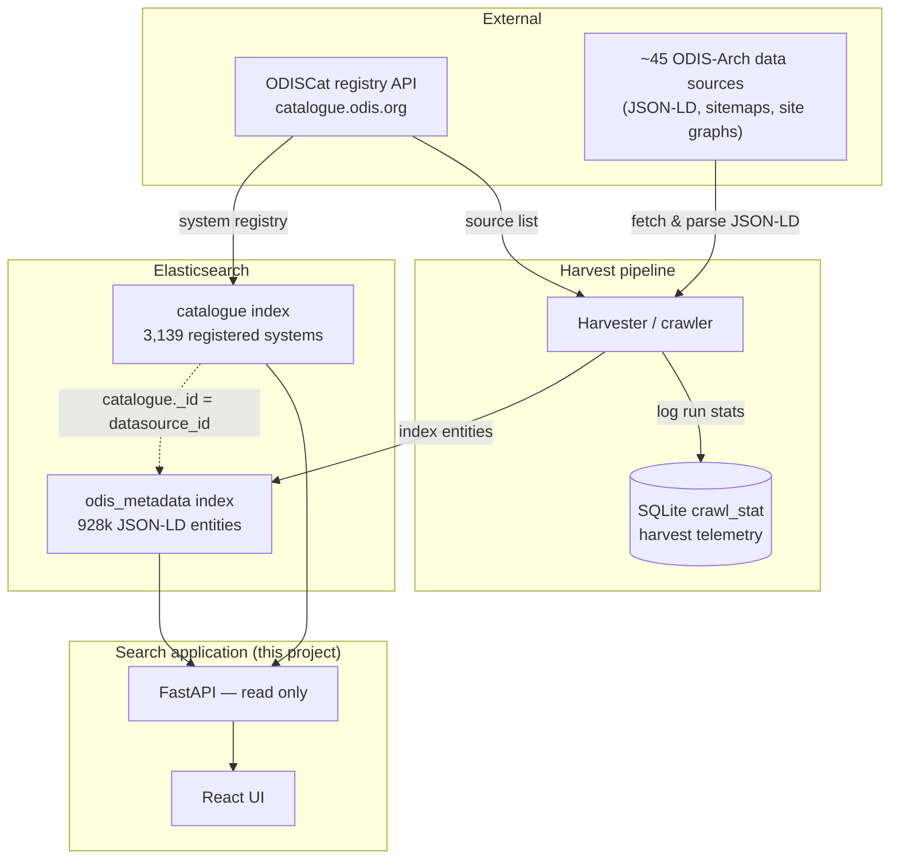

# ODIS Data Sources Analysis

> This analysis was generated by Cursor.

**Date:** 2026-07-03  
**Sources inspected:** Elasticsearch @ `http://localhost:9200`, SQLite @ `/var/www/html/odis-php/var/data.db`

This document describes what data exists, how it is structured, and what that implies for building a search system. It is a data inventory only — not a survey of any existing application.

---

## Executive summary

| Store | Location | Contents | Useful for search? |
|-------|----------|----------|-------------------|
| `odis_metadata` | **Elasticsearch** | ~928k JSON-LD entities (datasets, people, orgs, plus many structural sub-entities) | **Yes — primary corpus** |
| `catalogue` | **Elasticsearch** | 3,139 registered ocean data systems (ODISCat entries) | **Yes — secondary corpus** |
| `searchlog` | Elasticsearch | ~654k historical filter/search events | Analytics only |
| SQLite | `/var/www/html/odis-php/var/data.db` | Crawl job telemetry (`crawl_stat`, 142 rows) | **No** |

**Both searchable corpora live in Elasticsearch.** SQLite holds operational crawl statistics, not catalogue or metadata content.

The two ES indices answer different questions:

- **`catalogue`** — *Which data systems exist?* (portals, catalogues, repositories)
- **`odis_metadata`** — *What records were harvested from those systems?* (individual datasets, people, publications, …)

They link via `catalogue._id` ↔ `odis_metadata.datasource_id`.

---

## 1. Data harvesting architecture

Search reads from Elasticsearch. The indices are populated by a **separate harvest pipeline** (out of scope for the search app). This diagram shows how data flows into the stores the search system queries:



**What the search app owns:** FastAPI + React only. It does not run the harvester, write to Elasticsearch, or read SQLite.

**What the harvester owns:** Discovering sources from ODISCat, crawling remote sites, parsing JSON-LD graphs, bulk-indexing into `odis_metadata`, and logging run metrics to SQLite.

---

## 2. Elasticsearch cluster

```
Version:  7.17.29
Node:     odis.org
User:     odis_metadata
```

### Indices

| Index | Documents | Size | Notes |
|-------|-----------|------|-------|
| `odis_metadata` | 928,252 | 776 MB | Harvested JSON-LD |
| `catalogue` | 3,139 | 9.7 MB | ODISCat registry |
| `searchlog` | 654,242 | 45 MB | Event log, not content |
| `catalogue_stag` | 3,068 | 3.9 MB | Staging mirror of `catalogue` |
| `searchlog_stag` | 1,079 | 261 KB | Staging mirror of `searchlog` |

Single-node cluster (indices show `yellow` — unassigned replicas; queries work normally).

---

## 3. Index: `odis_metadata`

### Nature of the data

Each document is a **schema.org / JSON-LD entity** extracted from one of ~45 registered ODIS-Arch data sources. A single web page often yields multiple documents — the full JSON-LD graph is split into separate indexed entities (Dataset, Place, GeoShape, DataDownload, ContactPoint, etc.).

This decomposition is the most important structural fact for search design: **most documents are graph fragments, not user-facing records.**

### Document fields (searchable at root level)

| Field | ES type | Coverage | Role |
|-------|---------|----------|------|
| `url` | keyword | 100% | Source page URL |
| `datasource_id` | text/keyword | 100% | Parent ODISCat ID |
| `indexed_at` | text | most | Harvest timestamp |
| `@type` | text/keyword | most | schema.org type(s) |
| `name`, `schema:name` | text/keyword | **17%** | Title |
| `description`, `schema:description` | text | subset | Body text |
| `keywords`, `schema:keywords` | text/keyword | subset | Subject terms |
| `author`, `creator`, `publisher`, … | flattened | subset | Relation nodes (not fully searchable) |
| `data` | object (subfields disabled) | subset | Full JSON-LD blob, stored not indexed |

Coordinates and bounding boxes exist inside `data` on separate GeoShape documents but are **not indexed for geo queries** (see §5).

### Type distribution

| `@type` | Count | Search relevance |
|---------|-------|------------------|
| `schema:DataDownload` | 290,076 | Low — file/link nodes |
| `schema:ContactPoint` | 107,666 | Low |
| `schema:Place` | 107,630 | Low — location fragments |
| `schema:GeoShape` | 107,594 | Low — bbox fragments |
| `schema:Dataset` + `Dataset` | ~94,000 | **High** |
| `CreativeWork` (+ schema variant) | ~93,000 | **High** |
| `Person` | 37,666 | **High** |
| `Organization` | 15,457 | **High** |
| `DataCatalog` (+ schema variant) | ~56,000 | Medium |
| `Event` | 4,049 | Medium |
| `ResearchProject` | ~4,200 | Medium |

**772,699 documents (83%) have no `name` field.** Any search over this index must filter by type or users will see empty, meaningless results.

`@type` values are inconsistent: `Dataset`, `schema:Dataset`, and prefixed URIs all appear for the same concept. Faceting requires normalisation at query time.

### Top sources by volume

| `datasource_id` | Name (from `catalogue`) | Documents |
|-----------------|---------------------------|-----------|
| 3308 | IOOS Data Catalog | 770,924 |
| 4 | OceanExpert | 51,640 |
| 3215 | AquaDocs | 36,986 |
| 40 | MEDIN Portal | 19,508 |
| 343 | OBIS | 5,969 |

One source (IOOS) accounts for **83% of all documents** — relevance tuning and optional source filtering may be needed.

### Sample document

```json
{
  "_id": "ffb519bd6b732afc3948bfc8c1805a74",
  "datasource_id": "40",
  "indexed_at": "2026-04-09 16:12:19",
  "@type": "Dataset",
  "name": "1848-1975 Lundy Field Society The Marine Fauna of Lundy Ascidiacea",
  "description": "Collation of marine fauna records between 1848 and 1975...",
  "keywords": "Marine Environmental Data and Information Network, Species distribution...",
  "url": "http://portal.medin.org.uk/portal/?details&tpc=..."
}
```

---

## 4. Index: `catalogue`

### Nature of the data

Structured registry of **ocean data systems** — portals, catalogues, software, bibliographic databases — registered in ODISCat. Each document describes a *system*, not individual records within it.

Document `_id` is the ODISCat numeric identifier (e.g. `"43"`, `"3308"`).

### Fields

| Field | Description | Facet potential |
|-------|-------------|-----------------|
| `dsNameEnglish` | English name | Search + display |
| `dsNameOriginal` | Original-language name | Search |
| `dsAcronym` | Short name (OBIS, HAZADR, …) | Search |
| `dsAbstract` | Long description | Search |
| `dsURL` | System homepage | Link |
| `dsCountries` | `"CODE :: Country"` | **Facet** |
| `dsSiteCountries` | Hosting country | Facet |
| `mdSeaRegion` | Sea/ocean region(s) | **Facet** |
| `mdSpatialCoverage` | Free-text extent (264 entries) | Text only |
| `mdKeywords` | `" :: "`-separated terms | Search + facet |
| `mdThemes` | IODE discipline codes (DS01–DS12) | **Facet** |
| `mdTypes` | Resource type taxonomy | **Facet** |
| `mdPolicy` | Access policy | Facet |
| `mdM2MTechs` | API/download methods | Facet |
| `odisArchType` | Harvest method (Sitemap, Sitegraph) | Metadata |
| `entryDate`, `updateDate` | Unix timestamps | Sort |

Multi-value fields use `" :: "` as delimiter (e.g. `"DS01 Biological oceanography :: DS03 Physical oceanography"`).

### Content distribution

| Dimension | Top values |
|-----------|------------|
| Country | GLOBAL (872), US (598), REGIONAL (454), AU (146) |
| Sea region | World (1,305), Pacific Ocean (182), Atlantic Ocean (108) |
| Theme | DS03 Physical oceanography (491), DS06 Cross-discipline (248) |
| Type | Software (291), Data products (264), Bibliographic infobases (239) |

### Sample document

```json
{
  "_id": "43",
  "dsNameEnglish": "HAZADR",
  "dsAcronym": "HAZADR",
  "dsAbstract": "The Mediterranean is one of the busiest seas...",
  "dsURL": "http://jadran.izor.hr/hazadr/index_eng.htm",
  "mdSeaRegion": "Adriatic Sea :: Mediterranean Sea",
  "mdKeywords": "GIS :: HF radar :: oil spill mitigation",
  "mdThemes": "DS03 Physical oceanography",
  "mdTypes": "Data products :: Data systems/portals :: Maps and atlases"
}
```

### Link to `odis_metadata`

```
catalogue._id  ═══  odis_metadata.datasource_id
```

Use this to enrich metadata hits with the parent system name, or to filter metadata results to systems matching a catalogue facet (region, theme, country).

---

## 5. Index: `searchlog` (out of scope)

Event log of historical filter and search interactions against the catalogue index.

- 654k events; ~98% have empty `words` field
- Top terms when present: obis, argo, salinity, emodnet, bathymetry

Potentially useful later for a "popular searches" widget. Not a search corpus.

---

## 6. Spatial data capabilities

### What the mapping allows today

| Capability | Available? | Reason |
|------------|------------|--------|
| Bounding-box filter | **No** | No `geo_point` / `geo_shape` fields |
| Distance / polygon query | **No** | Same |
| Geohash grid (map clusters) | **No** | Requires indexed geo field |
| Sea region text facet | **Yes** | `catalogue.mdSeaRegion` |
| Country text facet | **Yes** | `catalogue.dsCountries` |
| Free-text place names | **Partial** | `catalogue.mdSpatialCoverage` (264 prose entries) |

Spatial fields in `odis_metadata` are mapped as **`flattened`**, not geo types:

```
spatialCoverage, geo, schema:geo, schema:spatialCoverage  →  flattened
```

Bounding box coordinates **do exist** in the index but on separate graph-fragment documents, stored in the non-indexed `data` object:

```json
{
  "@type": "schema:GeoShape",
  "data": { "schema:box": { "value": "26.90543 -90.28967 27.159443 -89.91208" } }
}
```

107,594 such documents exist. Zero documents have queryable root-level geo fields.

**Conclusion:** Text-based geographic faceting (sea region, country) is viable now. Map-based spatial search and gridded result clustering require a reindex that extracts geometry onto parent records as proper `geo_point` / `geo_shape` fields.

---

## 7. SQLite — harvest telemetry (out of scope for search)

Path on host: `/var/www/html/odis-php/var/data.db` (416 KB)

Written by the harvest pipeline, not by the search application.

| Table | Rows | Contents |
|-------|------|----------|
| `crawl_stat` | 142 | Harvest run metrics (pages fetched, JSON-LD counts, errors, timestamps) |
| `messenger_messages` | 0 | Empty queue |
| `doctrine_migration_versions` | 0 | Unused |

No catalogue entries. No metadata records. Not a search backend.

---

## 8. Implications for a new search system

These follow directly from the data shape:

1. **Two indices, two schemas.** The API must normalise unlike field names (`name` vs `dsNameEnglish`, `keywords` vs `mdKeywords`) into a common result format.

2. **Type filtering is mandatory for metadata.** Without it, 83% of hits are nameless graph fragments (DataDownload, Place, GeoShape, …).

3. **`@type` normalisation is required.** The same concept appears as `Dataset`, `schema:Dataset`, etc. Facet counts need a runtime normalisation step.

4. **Catalogue is small enough to cache.** 3,139 documents fit in memory — batch-fetch for datasource enrichment is cheap.

5. **Unified search is a product choice, not a data requirement.** The indices can be searched independently or merged; joining happens via `datasource_id`.

6. **Exclude `data` from search responses.** The stored JSON-LD blob is large; return it only on explicit detail requests.

7. **Spatial search is a future index change**, not an API change. The data contains coordinates but they are not indexed for geo queries.

8. **SQLite and `searchlog` are optional extras**, not part of core faceted search.

---

## 9. Connection reference

```env
ELASTICSEARCH_URL=http://localhost:9200
ELASTICSEARCH_USER=odis_metadata
ELASTICSEARCH_PASSWORD=o6OooD78y4jbCcl=pHly
```

```bash
# Document counts
curl -u "$ELASTICSEARCH_USER:$ELASTICSEARCH_PASSWORD" \
  http://localhost:9200/odis_metadata/_count

curl -u "$ELASTICSEARCH_USER:$ELASTICSEARCH_PASSWORD" \
  http://localhost:9200/catalogue/_count

# Sample search
curl -u "$ELASTICSEARCH_USER:$ELASTICSEARCH_PASSWORD" \
  -H "Content-Type: application/json" \
  -X POST http://localhost:9200/odis_metadata/_search \
  -d '{"query":{"multi_match":{"query":"salinity","fields":["name","description","keywords"]}},"size":5}'
```
