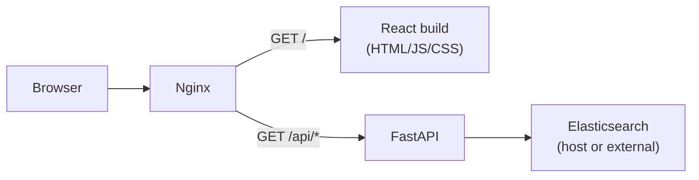

# Faceted Search System Plan

> This plan was generated by Cursor.

**Date:** 2026-07-03  
**Related:** [Data Sources Analysis](./data-sources-analysis.md)

Greenfield design for a faceted search UI over the ODIS Elasticsearch indices. Python API, React frontend, minimal dependencies.

---

## 1. Problem

ODIS holds two related bodies of searchable data in Elasticsearch:

| Corpus | Question it answers | Scale |
|--------|-------------------|-------|
| `odis_metadata` | What individual records exist? (datasets, experts, publications) | ~928k docs |
| `catalogue` | What data systems/portals are registered? | 3,139 docs |

Users need to search both, filter by type / region / theme / country, and get readable result cards — without wading through 290k nameless `DataDownload` graph nodes.

---

## 2. System

**Read-only.** The API queries Elasticsearch; it does not harvest, write, or index.

**Out of scope:** Harvest pipeline, SQLite (`crawl_stat`), `searchlog` analytics index.

### Runtime (production)



### Docker layout

Two compose files — same services, different frontend serving strategy:

| Service | Dev | Prod |
|---------|-----|------|
| **nginx** | Reverse proxy, port 8080 | Reverse proxy + static file server, port 80 |
| **api** | FastAPI with hot reload (`uvicorn --reload`) | FastAPI (`uvicorn`, multi-worker optional) |
| **web** | Vite dev server (HMR) | *Not running* — `dist/` baked into nginx image |

Elasticsearch runs **outside** the compose stack (existing host install). Containers reach it via `ELASTICSEARCH_URL`.

```
┌─────────── docker compose ───────────┐
│                                      │
│  nginx:8080 ──┬── /     → web:5173   │  (dev)
│               └── /api  → api:8000   │
│                                      │
│  nginx:80 ────┬── /     → /usr/share/nginx/html  │  (prod)
│               └── /api  → api:8000   │
│                                      │
└──────────────────────────────────────┘
                    │
                    ▼
           Elasticsearch :9200
           (host.docker.internal)
```

### Repo layout

```
odis-ui/
├── docs/
├── docker/
│   ├── docker-compose.yml          # dev
│   ├── docker-compose.prod.yml     # prod
│   └── nginx/
│       ├── nginx.dev.conf          # proxy / → vite, /api → api
│       └── nginx.prod.conf         # serve static /, proxy /api → api
├── api/
│   ├── Dockerfile
│   ├── app/
│   └── tests/
└── web/
    ├── Dockerfile                  # dev: vite dev server
    ├── Dockerfile.prod             # multi-stage: npm build → nginx static
    └── src/
```

---

## 3. Stack (minimal)

### API

| Piece | Choice |
|-------|--------|
| Framework | FastAPI |
| ES client | `elasticsearch` (async) |
| Config | `pydantic-settings` + `.env` |
| Tests | pytest + httpx |

No ORM, no cache server, no task queue.

### Frontend

| Piece | Choice |
|-------|--------|
| Build | Vite + React + TypeScript |
| Fetch | `fetch` + small `useSearch` hook |
| State | URL query params (`URLSearchParams`) |
| Style | Plain CSS |

Deferred until clearly needed: TanStack Query, React Router, Tailwind, component libraries, OpenAPI codegen.

---

## 4. API

Base: `/api/v1` · JSON only · Errors: `{ "detail": "…" }`

### 4.1 Search

```
GET /api/v1/search
```

Single endpoint. All filters are query params.

| Param | Type | Default | Applies to |
|-------|------|---------|------------|
| `q` | string | — | both |
| `corpus` | `records` \| `systems` \| `both` | `records` | which index(es) |
| `types` | string[] | primary types* | `records` |
| `themes` | string[] | — | `systems` |
| `regions` | string[] | — | `systems` |
| `countries` | string[] | — | `systems` |
| `source` | string | — | `records` — filter by `datasource_id` |
| `sort` | `relevance` \| `title` | `relevance` | both |
| `page` | int | 1 | both |
| `size` | int | 20 (max 50) | both |

\*Primary types default when none selected:

```
dataset, person, organization, creativework, event, researchproject
```

This excludes graph fragments (DataDownload, Place, GeoShape, ContactPoint) that make up 83% of the index and have no title.

#### Response

```json
{
  "total": 412,
  "facets": {
    "types": [{ "value": "dataset", "count": 380 }],
    "regions": [{ "value": "Pacific Ocean", "count": 12 }],
    "sources": [{ "id": "3308", "name": "IOOS Data Catalog", "count": 210 }]
  },
  "items": [
    {
      "id": "ffb519bd…",
      "corpus": "records",
      "title": "Salinity observations — Bellingham Bay",
      "summary": "Hourly salinity measurements from…",
      "type": "Dataset",
      "url": "https://data.ioos.us/dataset/…",
      "source": { "id": "3308", "name": "IOOS Data Catalog" },
      "highlight": { "summary": "Hourly <em>salinity</em>…" }
    },
    {
      "id": "892",
      "corpus": "systems",
      "title": "SOCIB Data Centre",
      "summary": "Operational oceanography data portal…",
      "type": "Data systems/portals",
      "url": "https://www.socib.es/",
      "region": "Mediterranean Sea",
      "theme": "DS03 Physical oceanography"
    }
  ],
  "page": 1,
  "size": 20
}
```

Every item in `items[]` shares the same card shape (`title`, `summary`, `type`, `url`) regardless of corpus. Corpus-specific fields (`source`, `region`, `theme`) are optional.

When `corpus=both`, run two ES queries in parallel, normalise, merge by score, paginate the combined list.

### 4.2 Record detail (optional, post-MVP)

```
GET /api/v1/records/{id}?corpus=records
GET /api/v1/systems/{id}
```

Return one document. Include `raw` JSON-LD blob only when `?raw=1`.

### 4.3 Health

```
GET /api/v1/health
```

ES ping + index existence check.

---

## 5. Query design

Derived from index structure (see data analysis), not from any prior application.

### 5.1 Records (`odis_metadata`)

**Problem:** `@type` is inconsistent; 83% of docs have no `name`.

**Solution:** Runtime field `record_type` normalises `@type` at query time (strip `schema:` prefix and URI, lowercase). Default filter to primary types. Full-text via `multi_match`:

```
fields: name^3, schema:name^3, description, schema:description, keywords^2, schema:keywords^2
```

**Facets:** `terms` agg on `record_type`; `terms` agg on `datasource_id`.

**Source filter:** exclude `data` and large flattened relation fields from `_source`.

### 5.2 Systems (`catalogue`)

Straightforward — clean schema, all docs have titles.

**Full-text:** `multi_match` on `dsNameEnglish^3`, `dsAcronym^3`, `dsAbstract`, `mdKeywords^2`.

**Facets:** `mdThemes.keyword`, `mdSeaRegion.keyword`, `dsCountries.keyword`, `mdTypes.keyword`.

**Multi-value fields** use ` :: ` delimiter; facet keys match stored strings exactly.

### 5.3 Cross-corpus filtering

When user picks a region/theme/country (systems facets) but searches records:

1. Query `catalogue` for matching system IDs.
2. Filter `odis_metadata` with `terms` on `datasource_id`.

When user picks a source filter on records, look up the system name from `catalogue` for display.

### 5.4 Catalogue cache

3,139 systems fit in an in-memory dict keyed by `_id`. Load on startup (or first request), refresh on TTL. Avoids repeated ES lookups during enrichment.

---

## 6. Frontend

One page. URL is the source of truth.

```
/?q=salinity&corpus=both&types=dataset&regions=Pacific+Ocean&page=1
```

```
┌──────────────────────────────────────────────────────┐
│  [ search box                              ] Search  │
├────────────┬─────────────────────────────────────────┤
│  corpus:   │  412 results                            │
│  ○ records │                                         │
│  ○ systems │  ┌─ Dataset ─────────────────────────┐ │
│  ● both    │  │ Salinity obs — Bellingham Bay     │ │
│            │  │ IOOS Data Catalog                 │ │
│  type      │  └───────────────────────────────────┘ │
│  ☐ Dataset │  ┌─ Data portal ─────────────────────┐ │
│  ☐ Person  │  │ SOCIB Data Centre · Mediterranean │ │
│            │  └───────────────────────────────────┘ │
│  region    │  [ prev  1  2  3  next ]               │
│  ☐ Pacific │                                         │
└────────────┴─────────────────────────────────────────┘
```

**Components:** `SearchBar`, `FacetPanel`, `ResultList`, `ResultCard`, `Pagination`. Start in one `App.tsx`; split when it hurts.

**Data flow:**

```
filter change → update URL → useSearch refetches → render
```

No client-side cache library needed.

---

## 7. Spatial search

**Not available on the current index.** See [data analysis §6](./data-sources-analysis.md#6-spatial-data-capabilities).

| Now | Later (requires reindex) |
|-----|--------------------------|
| Region/country text facets | Bbox filter (`?bbox=w,s,e,n`) |
| | Geohash grid endpoint for map clusters |
| | `geo_point` / `geo_shape` on parent records |

Do not design the v1 API around spatial params. Add them when the index supports them.

---

## 8. Docker

### Development

`docker compose up` starts three containers. Nginx is the single entry point — the browser never talks to Vite or FastAPI directly.

**`docker/docker-compose.yml`** (sketch):

```yaml
services:
  api:
    build: ../api
    volumes:
      - ../api:/app          # hot reload
    env_file: ../api/.env
    extra_hosts:
      - "host.docker.internal:host-gateway"

  web:
    build:
      context: ../web
      target: dev
    volumes:
      - ../web:/app          # HMR
    environment:
      VITE_API_URL: /api/v1  # relative — nginx proxies /api

  nginx:
    image: nginx:alpine
    ports:
      - "8080:80"
    volumes:
      - ./nginx/nginx.dev.conf:/etc/nginx/conf.d/default.conf:ro
    depends_on:
      - api
      - web
```

**`nginx.dev.conf`** routing:

| Path | Upstream |
|------|----------|
| `/` | `http://web:5173` (Vite dev server, WebSocket upgrade for HMR) |
| `/api/` | `http://api:8000` |

Access at `http://localhost:8080`.

### Production

React is built to static files; nginx serves them directly. No Node process at runtime.

**Build flow:**

1. `web/Dockerfile.prod` — stage 1: `npm run build` → `dist/`; stage 2: copy `dist/` into `nginx:alpine`.
2. Or: build `dist/` in CI, copy into nginx image at deploy time.

**`docker-compose.prod.yml`** runs two containers:

```yaml
services:
  api:
    build: ../api
    env_file: ../api/.env
    restart: unless-stopped
    extra_hosts:
      - "host.docker.internal:host-gateway"

  nginx:
    build:
      context: ../web
      dockerfile: Dockerfile.prod
    ports:
      - "80:80"
    volumes:
      - ./nginx/nginx.prod.conf:/etc/nginx/conf.d/default.conf:ro
    depends_on:
      - api
    restart: unless-stopped
```

**`nginx.prod.conf`** routing:

| Path | Handler |
|------|---------|
| `/` | `root /usr/share/nginx/html; try_files $uri /index.html` |
| `/api/` | `proxy_pass http://api:8000` |

Static assets get long cache headers; `index.html` is not cached (SPA updates).

### Elasticsearch connectivity

ES is not containerised in this project — it already runs on the host.

```env
# api/.env (inside container)
ELASTICSEARCH_URL=http://host.docker.internal:9200
```

On Linux, `extra_hosts: host.docker.internal:host-gateway` maps the host. Alternatively, use the host's LAN IP or run ES on a shared Docker network if it is containerised separately.

### API Dockerfile (sketch)

```dockerfile
FROM python:3.12-slim
WORKDIR /app
COPY pyproject.toml .
RUN pip install .
COPY app/ app/
CMD ["uvicorn", "app.main:app", "--host", "0.0.0.0", "--port", "8000"]
```

Dev compose overrides CMD with `--reload`.

---

## 9. Phases

### Phase 1 — Core (2–3 weeks)

- [ ] Docker dev stack (api + web + nginx)
- [ ] FastAPI + ES connection
- [ ] `GET /api/v1/search` with `corpus=records` — text search, type facet, pagination
- [ ] `GET /api/v1/health`
- [ ] React: search box, type checkboxes, result list, URL sync
- [ ] Production Dockerfile + compose (static React via nginx)

### Phase 2 — Systems + facets (1–2 weeks)

- [ ] `corpus=systems` — search catalogue with theme/region/country facets
- [ ] Facet panel in UI

### Phase 3 — Combined (1 week)

- [ ] `corpus=both` — parallel queries, merged results
- [ ] Source enrichment via catalogue cache
- [ ] Cross-corpus region filter (systems facet → records filter)

### Phase 4 — Spatial (when index ready)

- [ ] Reindex with `geo_point` / `geo_shape`
- [ ] `bbox` param + grid endpoint
- [ ] Map view

---

## 10. Config

```env
# api/.env
ELASTICSEARCH_URL=http://host.docker.internal:9200   # inside Docker
# ELASTICSEARCH_URL=http://localhost:9200            # bare-metal dev
ELASTICSEARCH_USER=odis_metadata
ELASTICSEARCH_PASSWORD=…
ES_INDEX_RECORDS=odis_metadata
ES_INDEX_SYSTEMS=catalogue

# web — use relative URL so nginx proxy works in both dev and prod
VITE_API_URL=/api/v1
```

Use `catalogue_stag` / staging indices via env vars in non-prod.

---

## 11. Risks

| Risk | Mitigation |
|------|------------|
| Nameless graph nodes pollute results | Default primary-type filter |
| IOOS = 83% of records | Optional `source` filter; consider score diversity |
| Two schemas, one UI | Normalise to shared `items[]` shape in API |
| `@type` inconsistency | Runtime `record_type` field |
| Large `_source` payloads | Exclude `data` blob from list responses |
| Spatial not indexed | Ship text region facets; defer map |

---

## 12. Done when

- [ ] Text search over records returns titled, typed results in < 500 ms
- [ ] Type facet excludes graph fragments
- [ ] Systems searchable with region/theme/country filters
- [ ] Filter state in URL, shareable
- [ ] `docker compose up` runs full dev stack on port 8080
- [ ] Production compose serves static React + proxies API via nginx
- [ ] ≤ 5 frontend npm dependencies beyond React + Vite
- [ ] Search app has no dependency on harvest pipeline or SQLite
