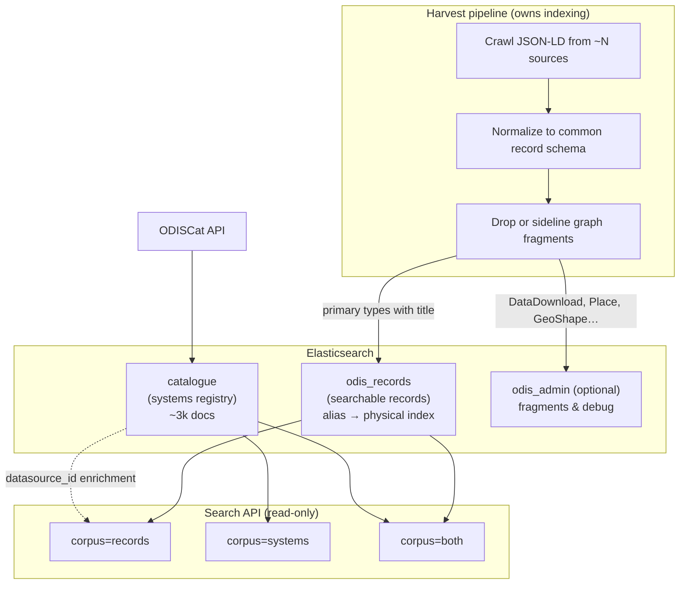

# Indexing Strategy

> Recommendations for scaling ODIS search indexing: corpus layout, normalized fields, and raw payload storage.

**Date:** 2026-07-22  
**Related:** [Data Sources Analysis](./data-sources-analysis.md), [Partial Documents & Harvesting Strategy](./partial-documents-harvesting-strategy.md), [Record Type Field Population](./record-type-field-population.md), [Spatial Coverage Analysis](./spatial-coverage-analysis.md), [Faceted Search Plan](./faceted-search-plan.md)

---

## Executive summary

**Do not adopt one-index-per-source at scale.** The Gleaner model (one Elasticsearch index per harvest source) works for a small curated set but does not scale to thousands of ODISCat-registered systems.

**Do adopt a small number of purpose-built indices with normalized fields at ingest time.**

| Index | Purpose | Scale today | Scale target |
|-------|---------|-------------|--------------|
| `catalogue` | Registered data systems (ODISCat) | 3,139 docs | Keep separate — different corpus, different schema |
| `odis_records` | User-facing searchable records | ~250k meaningful docs (filtered from 928k) | Single index to tens of millions |
| *(optional)* `odis_admin` | Graph fragments, crawl metadata, debug | Remaining ~680k fragments | Only if needed for graph traversal / QA |

Each searchable record uses **three layers**:

1. **Search surface** — normalized fields used for full-text search, sort, and common facets.
2. **Typed extensions** — type-specific fields promoted when faceting or filtering needs them.
3. **Raw payload** — the original JSON-LD stored as a structured object (`enabled: false`), not a JSON string.

The real problem with the current `odis_metadata` index is not Elasticsearch struggling with mixed schemas. It is that **everything harvested gets indexed together** — including graph fragments (`DataDownload`, `Place`, `GeoShape`, `ContactPoint`) that should not appear in search results. Normalization belongs in the harvest pipeline, not in thousands of physical indices.

**Bounding-box spatial search is a core requirement**, not a later enhancement. Bboxes exist in the corpus today (~66% of datasets in sample) but live inside the stored `data` blob and are **not indexed for geo queries**. The new `odis_records` index must promote extents to `geo_shape` / `geo_point` fields at ingest time. See [§6 Spatial indexing](#6-spatial-indexing-for-bounding-box-search).

---

## 1. Current state

### 1.1 Default backend (`odis_metadata`)

- One physical index, all sources, all `@type` values mixed.
- Each document carries `datasource_id` linking to `catalogue._id`.
- Search works only because the API **filters at query time** to primary record types and requires searchable text fields.
- 83% of documents have no `name` field; graph fragments dominate by volume.
- One source (IOOS, id 3308) accounts for 83% of all documents — relevance skew even within a single index.
- Non-search fields live in a `data` object (subfields disabled, stored not indexed).

See [Data Sources Analysis §3](./data-sources-analysis.md#3-index-odis_metadata).

### 1.2 Gleaner backend

- One index per source: `gleaner-obps`, `gleaner-medin`, etc.
- Ingest produces a **normalized document shape**: `name`, `description`, `type`, `source`, `url`, `jsonld` (raw stored separately).
- Cross-source search = multi-index query over a hardcoded list of indices.
- Works well for a curated, small set with a dedicated harvest pipeline.

### 1.3 Catalogue (`catalogue`)

- Fundamentally different data: systems/portals, not harvested records.
- Clean, stable schema (`dsNameEnglish`, `mdSeaRegion`, `mdThemes`, …).
- Correctly kept separate; used for enrichment and (planned) cross-corpus filtering.

Link: `catalogue._id` ═══ `odis_metadata.datasource_id`.

---

## 2. Evaluating the two extremes

### Option A: One index per source (Gleaner model)

| Pros | Cons |
|------|------|
| Per-source schema freedom | **~3,000 indices** if every catalogue entry becomes a source |
| Independent reindex per source | Cluster state overhead grows linearly with index count |
| Source isolation (permissions, SLA) | Cross-source search = query N indices every time |
| Easy to drop a misbehaving source | Mapping updates must be applied N times |
| | Operational complexity: monitoring, backups, aliases per source |
| | Hardcoded source lists don't scale |

**Verdict:** Appropriate for **tens** of sources with genuinely different ingest pipelines or isolation requirements. **Not appropriate** for thousands of ODISCat-registered systems where most share the same schema.org JSON-LD harvest pattern.

At 3,000 sources with even 1 shard each, cluster-management pain arrives long before data volume becomes the bottleneck.

### Option B: Everything in one index (`odis_metadata` model)

| Pros | Cons |
|------|------|
| Simple cross-source search | Graph fragments pollute the index (~680k low-value docs) |
| One mapping to maintain | Field name inconsistency (`name` vs `schema:name`) |
| Efficient aggregations on `datasource_id` | Source dominance (IOOS) skews relevance and facets |
| Standard ES pattern for heterogeneous docs | Spatial data buried in unindexed `data` blob |
| Scales to millions of docs in one index | Query-time type filtering is a band-aid, not a fix |

**Verdict:** The single-index **pattern** is correct. The current **content** of that index is wrong — it stores the full decomposed JSON-LD graph rather than searchable records.

### Schema heterogeneity is not the main concern

Elasticsearch has always supported different document shapes in one index. schema.org types (`Dataset`, `Person`, `Organization`) share a **common search surface**: title, description, keywords, url, spatial, source. Type-specific fields can live in a `extensions` object with `"dynamic": false` or in the stored-but-unindexed `raw` blob.

The current pain comes from **field name inconsistency** and **indexing non-records**, not from ES being unable to handle mixed types. Gleaner's normalized schema is the right idea — apply it **at ingest**, not by splitting indices.

---

## 3. Recommended architecture



### 3.1 Keep `catalogue` separate

No change needed. It answers a different question ("what systems exist?"), has a stable schema, is small enough to cache entirely in memory, and supports region/theme/country facets that don't exist on record documents.

Cross-corpus filtering (planned in [Faceted Search Plan §5.3](./faceted-search-plan.md#53-cross-corpus-filtering)): query `catalogue` for matching system IDs → filter `odis_records` by `datasource_id`.

### 3.2 One primary records index: `odis_records`

All harvested sources write into **one index** (or one index per major **version** with an alias). Differentiation by source is a **field** (`datasource_id`), not an index boundary.

| Dimension | Assessment |
|-----------|------------|
| Document count | 928k today → low tens of millions is fine in one index |
| Source count | 45 active today, 3,139 registered — `terms` agg on `datasource_id` handles thousands of facet buckets |
| Schema variation | Normalized at ingest; common search fields + optional type-specific nested object |
| Relevance skew | Address with per-source boost or `function_score`, not index splitting |
| Reindex | Alias swap (`odis_records` → `odis_records_v2`) — no per-source coordination |

### 3.3 Index-time filtering

Move the type filter from **query time** (current API) to **index time** (harvest pipeline):

**Index into `odis_records`:**

- Primary types: Dataset, Person, Organization, CreativeWork, Event, ResearchProject, BoatTrip, Service, DataCatalog (if desired)
- Must have a searchable title (`name` or `schema:name`)

**Do not index (or sideline to `odis_admin`):**

- `DataDownload`, `ContactPoint`, `Place`, `GeoShape` — graph fragments
- Documents with no title and no description

This alone removes ~680k documents from the search corpus. See also [Partial Documents & Harvesting Strategy](./partial-documents-harvesting-strategy.md) for graph-assembly alternatives.

### 3.4 When to split indices

Split only on **corpus boundaries**, not source boundaries:

| Split criterion | Example | When |
|-----------------|---------|------|
| Different user question | `catalogue` vs `odis_records` | Already done |
| Different access pattern | Public search vs admin/debug | Optional `odis_admin` |
| Different retention | Crawl logs vs records | If adding time-series data |
| Hard isolation requirement | Embargoed source, separate tenant | Rare; use filtered alias or separate cluster |

**Do not split** on `@type` unless users never cross-search types. ODIS users do cross-search (datasets + people + orgs), so one records index is correct.

**Do not split** on `datasource_id`. Use it as a filter field.

---

## 4. Document schema: three layers

Each indexed record is not "normalized fields + JSON string". It is three deliberate layers.

### 4.1 Layer 1 — Search surface (indexed)

Normalized fields common across record types. Used for full-text search, sort, and primary facets.

| Field | ES type | Notes |
|-------|---------|-------|
| `title` | text + keyword subfield | From `name` / `schema:name` at ingest |
| `description` | text | From `description` / `schema:description` |
| `keywords` | text + keyword subfield | Array or delimited string normalized to array |
| `record_type` | keyword | Lowercase enum: `dataset`, `person`, `organization`, … |
| `datasource_id` | keyword | Links to `catalogue._id` |
| `url` | keyword | Canonical record URL |
| `indexed_at` | date | Harvest timestamp |
| `source_page_url` | keyword | Page the record was harvested from |
| `spatial.footprint` | geo_shape | **Required for bbox search** — envelope or geometrycollection (see [§6](#6-spatial-indexing-for-bounding-box-search)) |
| `spatial.centroid` | geo_point | Representative point for map clustering; degenerate boxes and point records |
| `spatial.has_extent` | boolean | Fast filter for records with / without spatial coverage |

Recommended `multi_match` fields (same as current API, but on normalized names):

```
title^3, description, keywords^2
```

### 4.2 Layer 2 — Typed extensions (selectively indexed)

Type-specific fields promoted when product needs faceting or filtering. Mapped explicitly — not left to dynamic discovery.

```json
{
  "extensions": {
    "person": {
      "affiliation": "Intergovernmental Oceanographic Commission",
      "expertise": ["physical oceanography"]
    },
    "dataset": {
      "variable_measured": ["sea surface temperature"],
      "temporal_resolution": "hourly"
    }
  }
}
```

Mapping: `"dynamic": false` on the `extensions` object. Add subfields as requirements emerge.

**Promote to search surface** when broadly useful across types (e.g. `creators: ["Jane Doe"]` for author search). **Keep in extensions** when type-specific. **Leave in raw** when display-only or rarely queried.

### 4.3 Layer 3 — Raw payload (stored, not indexed)

Everything else from harvest. **Structured JSON object, not a JSON string.**

```json
{
  "title": "Salinity observations — Bellingham Bay",
  "record_type": "dataset",
  "datasource_id": "3308",
  "url": "https://data.ioos.us/dataset/example",
  "spatial": {
    "has_extent": true,
    "footprint": { "type": "envelope", "coordinates": [[-123.0, 48.8], [-122.5, 48.5]] },
    "centroid": { "lat": 48.65, "lon": -122.75 }
  },

  "raw": {
    "@type": "Dataset",
    "@id": "https://data.ioos.us/dataset/example",
    "schema:name": "Salinity observations — Bellingham Bay",
    "schema:description": "Hourly salinity measurements from…",
    "schema:distribution": [ … ],
    "author": { "@type": "Person", "name": "Jane Doe" }
  }
}
```

#### Why object, not string?

Elasticsearch already stores `_source` as JSON. Wrapping it in a string adds cost without benefit:

- No structured subfield access without parse/stringify on every read
- Cannot use `_source` filtering on nested paths
- No path to promote fields without a full re-parse pipeline

The current `odis_metadata` `data` field and Gleaner's `jsonld` field follow the correct pattern: **object with indexing disabled**.

#### Mapping

```json
"raw": {
  "type": "object",
  "enabled": false
}
```

`enabled: false` means: stored in `_source`, not indexed, no dynamic subfield mapping explosion.

#### Optional: full page graph

When the detail UI needs linked nodes (author → org → download links), store the full page graph separately:

```json
"graph": {
  "type": "object",
  "enabled": false
}
```

- **`raw`**: the specific entity's JSON-LD (what became this search result)
- **`graph`** (optional): the full `@graph` or parsed page, if needed for display

Do not index graph fragments as separate searchable documents. Keep them inside `graph` for detail views only.

#### Duplication is acceptable

Keep `raw` as the **faithful original** and `title` as the **normalized search field**. Do not mutate `raw` during normalization. The small storage overhead buys auditability and simpler reindex logic.

#### When a JSON string *does* make sense

Only in edge cases:

- Malformed/non-JSON payloads that cannot be parsed reliably
- Byte-for-byte preservation of the original HTTP response (provenance)
- Very large graphs offloaded to S3 with only a pointer stored in ES

For normal schema.org JSON-LD at ODIS scale, object storage in ES is the default.

### 4.4 Example document (complete)

```json
{
  "record_id": "ffb519bd6b732afc3948bfc8c1805a74",
  "title": "1848-1975 Lundy Field Society The Marine Fauna of Lundy Ascidiacea",
  "description": "Collation of marine fauna records between 1848 and 1975…",
  "keywords": ["Marine Environmental Data", "Species distribution"],
  "record_type": "dataset",
  "datasource_id": "40",
  "url": "http://portal.medin.org.uk/portal/?details&tpc=…",
  "source_page_url": "http://portal.medin.org.uk/portal/?details&tpc=…",
  "indexed_at": "2026-04-09T16:12:19Z",
  "spatial": {
    "has_extent": true,
    "centroid": { "lat": 51.1, "lon": -4.6 },
    "footprint": {
      "type": "envelope",
      "coordinates": [[-4.7, 51.2], [-4.5, 51.0]]
    }
  },
  "extensions": {},
  "raw": {
    "@type": "Dataset",
    "name": "1848-1975 Lundy Field Society The Marine Fauna of Lundy Ascidiacea",
    "description": "Collation of marine fauna records between 1848 and 1975…",
    "keywords": "Marine Environmental Data and Information Network, Species distribution…"
  }
}
```

---

## 5. Index mapping

```json
{
  "mappings": {
    "dynamic": "strict",
    "properties": {
      "record_id":         { "type": "keyword" },
      "title":             { "type": "text", "fields": { "keyword": { "type": "keyword" } } },
      "description":       { "type": "text" },
      "keywords":          { "type": "text", "fields": { "keyword": { "type": "keyword" } } },
      "record_type":       { "type": "keyword" },
      "datasource_id":     { "type": "keyword" },
      "url":               { "type": "keyword" },
      "source_page_url":   { "type": "keyword" },
      "indexed_at":        { "type": "date" },
      "spatial": {
        "properties": {
          "footprint":    { "type": "geo_shape" },
          "centroid":     { "type": "geo_point" },
          "has_extent":   { "type": "boolean" }
        }
      },
      "extensions": {
        "type": "object",
        "dynamic": false
      },
      "raw": {
        "type": "object",
        "enabled": false
      },
      "graph": {
        "type": "object",
        "enabled": false
      }
    }
  }
}
```

`dynamic: strict` on the root prevents stray harvest fields from polluting the mapping. New searchable fields are added deliberately.

Search queries should request only the search surface in `_source` (exclude `raw`, `graph`). Detail API returns `raw` on `?raw=1` — same pattern as the current [records endpoint](../api/app/api/v1/records.py).

---

## 6. Spatial indexing for bounding-box search

Bounding-box filter (`?bbox=west,south,east,north`) is a **first-class search feature**. It requires indexed geo fields on parent records at ingest time. Runtime extraction from `raw` (as the current API does for display) cannot power spatial filters at query scale.

See [Spatial Coverage Analysis](./spatial-coverage-analysis.md) for the full inventory of bbox paths and source-specific behaviour.

### 6.1 Current state (not searchable)

| Finding | Detail |
|---------|--------|
| Bbox format | schema.org GeoShape **box** string: `"southLat westLon northLat eastLon"` (WGS84 degrees) |
| Where bboxes live | Inside stored `data` / `raw` blob — not on indexed root fields |
| Root spatial fields | Mapped as `flattened` in `odis_metadata`; **0 documents populated** |
| Dataset coverage | ~66% of datasets in sample have at least one parseable box in `data` |
| Multi-extent | ~28% of bbox-bearing datasets have more than one box (up to 216 on a single record) |
| IOOS (ds 3308) | Bboxes often on **separate** `GeoShape` fragments referenced by `@id`, not inline on the Dataset |
| Geo query ready | **No** — requires extraction + graph resolution at ingest, then reindex |

The search API already extracts bboxes from `data` at **read time** for result-card display ([`api/app/search/elasticsearch/spatial.py`](../api/app/search/elasticsearch/spatial.py)). That logic is the starting point for the ingest pipeline, but the extracted geometry must be **written to indexed fields** when the record is created.

### 6.2 Target index fields

| Field | ES type | Purpose |
|-------|---------|---------|
| `spatial.footprint` | `geo_shape` | Bbox intersection queries (`?bbox=…`) |
| `spatial.centroid` | `geo_point` | Map clustering, point-only records |
| `spatial.has_extent` | `boolean` | Filter "records with spatial coverage" without geo math |

**Single extent** — store as an envelope:

```json
"spatial": {
  "has_extent": true,
  "footprint": {
    "type": "envelope",
    "coordinates": [[-3.7115, 54.0643], [-3.6885, 54.0491]]
  },
  "centroid": { "lat": 54.0567, "lon": -3.7000 }
}
```

**Multiple extents** — store as a `geometrycollection` of envelopes on the same field. Do **not** collapse to a single union envelope for search: a dataset with 216 regional boxes (e.g. datasource 364) would produce a world-spanning envelope and match almost any viewport.

```json
"spatial": {
  "has_extent": true,
  "footprint": {
    "type": "geometrycollection",
    "geometries": [
      { "type": "envelope", "coordinates": [[-8.0, 58.0], [-5.0, 55.0]] },
      { "type": "envelope", "coordinates": [[-4.7, 51.2], [-4.5, 51.0]] }
    ]
  },
  "centroid": { "lat": 55.5, "lon": -6.0 }
}
```

**Point records** (degenerate box where south = north and west = east) — set `spatial.centroid` and optionally a zero-area envelope. The current API treats these as `SpatialExtent.points`.

Individual boxes for display can be derived from `spatial.footprint` at read time, or denormalized into the API response without separate indexing.

### 6.3 Coordinate conversion

schema.org box strings use **`"south west north east"`** (lat, lon, lat, lon).

Elasticsearch `geo_shape` envelopes use **`[[minLon, maxLat], [maxLon, minLat]]`** (top-left, bottom-right corners in lon/lat order).

Conversion:

```
south, west, north, east  →  coordinates: [[west, north], [east, south]]
```

Example — UK DECC record (`54.0491 -3.7115 54.0643 -3.6885`):

```
schema.org:  south=54.0491  west=-3.7115  north=54.0643  east=-3.6885
ES envelope: [[-3.7115, 54.0643], [-3.6885, 54.0491]]
```

User query bbox `?bbox=west,south,east,north` maps directly to an ES envelope with the same formula. Assume WGS84 (EPSG:4326) unless CRS metadata on the source Place indicates otherwise.

### 6.4 Ingest extraction (harvest pipeline)

Extraction happens **at index time** on the assembled record, not at search time. Priority order (from [Spatial Coverage Analysis §7.2](./spatial-coverage-analysis.md#72-suggested-extraction-priority)):

1. `spatialCoverage[].geo[].box[.value]` — inline on Dataset (most UK sources)
2. `spatialCoverage.geo.box[.value]` — single Place
3. `spatialCoverage[].geo.box[.value]` — array Place, singular geo
4. **Resolve** `schema:geo.@id` → sibling `GeoShape` node → `schema:box` (IOOS pattern)
5. Direct `box` / `schema:box` on GeoShape nodes in the page graph
6. `polygon` strings → axis-aligned bbox (same logic as [`spatial.py`](../api/app/search/elasticsearch/spatial.py))

Handle both bare strings and wrapped `{ "value": "…" }` forms. This is the same class of problem as author/publisher promotion — **graph assembly at index time** ([Partial Documents §8](./partial-documents-harvesting-strategy.md#8-assembly-rules-what-to-denormalize)).

GeoShape / Place fragments must **not** be separate searchable documents, but the harvester **must** read them when resolving extent for the parent Dataset.

### 6.5 Query pattern

Add `bbox` to `SearchQuery` (comma-separated `west,south,east,north`). Append a filter clause:

```json
{
  "geo_shape": {
    "spatial.footprint": {
      "shape": {
        "type": "envelope",
        "coordinates": [[-10.0, 60.0], [5.0, 45.0]]
      },
      "relation": "intersects"
    }
  }
}
```

| `relation` | Semantics |
|------------|-----------|
| `intersects` | Record extent overlaps the query bbox (**default** — map viewport) |
| `within` | Record extent is fully inside the query bbox |
| `contains` | Record extent fully contains the query bbox |

Combine with existing text and facet filters via `bool.filter`. Records without `spatial.has_extent: true` are excluded when a bbox param is present.

Optional follow-ups (same index, no reindex needed once footprints exist):

- Geohash grid aggregation on `spatial.centroid` for map clustering
- `?has_spatial=true` filter using `spatial.has_extent`

### 6.6 What not to do for spatial

1. **Don't rely on runtime extraction from `raw` for search filters** — display only.
2. **Don't use the existing root `flattened` spatial fields** — they are unpopulated and not geo-queryable.
3. **Don't use a union envelope for multi-extent records** — use `geometrycollection`.
4. **Don't skip Place → GeoShape `@id` resolution at ingest** — IOOS and similar sources will have zero spatial coverage otherwise.
5. **Don't index GeoShape / Place as separate searchable docs** — resolve onto the parent record instead.

---

## 7. Field promotion policy

When the harvester encounters a JSON-LD field, apply this decision tree:

```
Is it needed for full-text search, sort, or a common facet?
  YES → normalize into search surface (title, description, keywords, spatial, …)
  NO  ↓

Is it type-specific but likely to be faceted or filtered?
  YES → add to extensions with explicit mapping
  NO  ↓

Leave in raw (stored, not indexed)
```

Extract at **ingest time** anything queried repeatedly (spatial, creators, dates). Runtime extraction from `raw` — as the current API does from `data` / `jsonld` — is acceptable as a migration bridge but not the long-term approach.

| Field (examples) | Destination | Rationale |
|------------------|-------------|-----------|
| `name`, `schema:name` | `title` | 100% of search queries |
| `description`, `schema:description` | `description` | Full-text search |
| `keywords`, `schema:keywords` | `keywords` | Full-text + future facet |
| `@type` | `record_type` | Facet (normalized) |
| `datasource_id` | `datasource_id` | Facet + cross-corpus join |
| `geo`, `spatialCoverage` | `spatial.footprint`, `spatial.centroid`, `spatial.has_extent` | **Bbox search** — extract + graph-resolve at ingest ([§6](#6-spatial-indexing-for-bounding-box-search)) |
| `author`, `creator`, `publisher` | `extensions.*` or `creators[]` | Promote when author search is required |
| `distribution`, `workLocation`, nested relations | `raw` or `graph` | Display / detail view only |

---

## 8. Operational patterns

### 8.1 Aliases

```
odis_records (alias) → odis_records_202607
catalogue (alias)    → catalogue_202607
```

Reindex into a new physical index, swap alias atomically. No downtime.

### 8.2 Sharding

For ~1M docs: **1 primary shard** is sufficient on the current single-node cluster. Revisit at ~50M docs or when moving to multi-node: 2–5 shards. Optionally use **`routing` on `datasource_id`** if per-source queries dominate — do not shard per source.

### 8.3 Source dominance (IOOS = 83%)

Index splitting will not fix relevance skew. Instead:

1. Cap facet bucket display ("top N sources + other") in the UI.
2. Use `function_score` or per-source boost/decay at query time.
3. Review whether IOOS indexing creates redundant structural sub-entities per dataset.
4. Optional `quality_score` at ingest (has description, keywords, spatial → higher).

---

## 9. Comparison matrix

| Criterion | One index / source | Single blob index (current) | **Recommended** |
|-----------|-------------------|----------------------------|-----------------|
| Scales to 3k sources | No | Yes | **Yes** |
| Cross-source search | Expensive (N-index query) | Cheap | **Cheap** |
| Schema consistency | Per-source freedom | None (raw JSON-LD) | **Normalized at ingest** |
| Index size efficiency | Good per index | Poor (680k junk docs) | **Good (filtered at ingest)** |
| Operational complexity | High (N indices) | Low | **Low** |
| Mapping evolution | N migrations | 1 migration | **1 migration + alias swap** |
| Raw payload storage | Per-source choice | `data` object | **`raw` object (`enabled: false`)** |
| Spatial search | Per-source varies | Not indexed | **`geo_shape` at ingest; bbox filter in Phase 2** |

---

## 10. Migration path

### Phase 1 — Ingest normalization (harvest pipeline)

- Add normalization layer: map `name`/`schema:name` → `title`, `@type` → `record_type`.
- **Extract spatial extent** from inline `spatialCoverage` and resolved Place → GeoShape references → `spatial.footprint` (`geo_shape`), `spatial.centroid`, `spatial.has_extent`. See [§6.4](#64-ingest-extraction-harvest-pipeline).
- Filter out graph fragments before indexing.
- Store original entity JSON-LD in `raw` (`enabled: false`).
- Write to new index `odis_records_v1` alongside existing `odis_metadata`.

### Phase 2 — API switch

- Point default backend at `odis_records` alias.
- Simplify query code: query normalized fields directly; remove query-time graph-fragment workarounds.
- **Add `bbox` search param** with `geo_shape` intersects filter on `spatial.footprint`.
- Keep `catalogue` enrichment unchanged (`datasource_id` → name lookup).
- Result-card spatial display reads from indexed `spatial.*` fields (fallback to `raw` extraction during transition).

### Phase 3 — Deprecate old index

- Once validated, drop `odis_metadata` or keep read-only for admin.
- Retire Gleaner multi-index backend for ODIS-Arch sources if no longer needed.

### Phase 4 — Enhance

- Geohash grid aggregation on `spatial.centroid` for map clustering.
- Implement cross-corpus filtering (catalogue region/theme → `datasource_id` filter).
- Promote fields into `extensions` as product requirements emerge.

---

## 11. What not to do

1. **Don't create one index per ODISCat entry.** Cluster management becomes the bottleneck before data volume does.
2. **Don't create one index per `@type`.** Users cross-search types; index splitting adds query complexity for no gain.
3. **Don't rely on query-time filtering to exclude graph fragments.** Wastes disk, slows aggregations, complicates relevance.
4. **Don't merge `catalogue` into the records index.** Different corpus, different schema, different facets.
5. **Don't index the full JSON-LD graph as separate searchable documents.** Store in `raw` / `graph`; index one record per user-facing entity.
6. **Don't store the raw payload as a JSON string** unless there is a specific provenance or parsing constraint.

7. **Don't defer spatial indexing to a later phase** — bbox search requires `geo_shape` on the record at ingest; runtime extraction from `raw` is display-only.

---

## 12. Summary

| Question | Answer |
|----------|--------|
| How many indices? | Two search corpora: `catalogue` + `odis_records`. Optional `odis_admin` for debug. |
| One index per source? | No — use `datasource_id` as a field. |
| Mixed schemas in one index? | Fine — normalize a common search surface; use `extensions` for type-specific fields. |
| What about the rest of the document? | Structured `raw` object with `enabled: false`, not a JSON string. Optional `graph` for full page context. |
| Where does normalization happen? | Harvest pipeline at index time, not the search API at query time. |
| How do bbox searches work? | Ingest promotes extents to `spatial.footprint` (`geo_shape`); API filters with `geo_shape` + `intersects`. Multi-extent records use `geometrycollection`. |

The scalable pattern:

> **Few indices defined by corpus purpose, normalized schema at ingest, source as a field not a boundary, raw JSON-LD stored as an unindexed object for detail views and future field promotion.**
