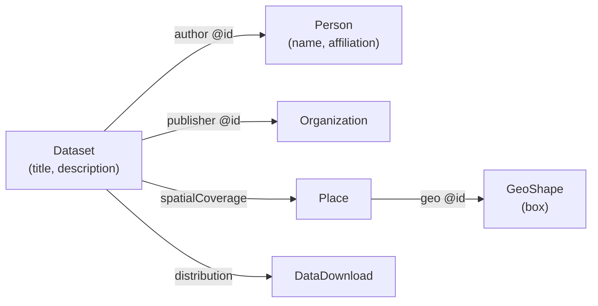

# Partial Documents & Harvesting Strategy

> Analysis for ODIS metadata ingestion when JSON-LD graphs are split into separate Elasticsearch documents linked by `@id`.

**Date:** 2026-07-14  
**Related:** [Data Sources Analysis](./data-sources-analysis.md), [Spatial Coverage Analysis](./spatial-coverage-analysis.md), [Record Type Field Population](./record-type-field-population.md)

---

## 1. Problem statement

The `odis_metadata` index stores **one Elasticsearch document per JSON-LD node**, not one document per user-facing record. A single harvest of a dataset landing page often produces a graph like:




After indexing, the **Dataset** document may contain only a reference:

```json
{
  "@type": "Dataset",
  "name": "Reef monitoring transects",
  "author": { "@id": "https://example.org/people/12345" }
}
```

while the **Person** document with full name and affiliation lives elsewhere — same index, different `_id`, possibly from the same page or a different crawl.

This is the same structural pattern already documented for **spatial extent** (Dataset → Place → GeoShape) and for **provenance** (author / creator / publisher). The search UI today reads what is on the primary document or walks the embedded `data` blob; it does not join across index documents.

**Symptom:** Search and result cards show incomplete records — IDs instead of names, missing bbox until graph resolution, empty relation fields at root level.

**Question:** Do we need a graph database before Elasticsearch, or can assembly happen in the harvest pipeline?

---


## 2. Short answer

**You do not need a graph database to get complete search documents.** For ODIS, the usual and appropriate pattern is:

1. **Harvest** JSON-LD graphs from each source.
2. **Resolve** references within the graph (and optionally against already-indexed entities).
3. **Assemble** a **search profile** document with denormalized fields for discovery and display.
4. **Index** that profile into Elasticsearch.

A graph database is optional — useful for RDF tooling, SPARQL, ontology reasoning, or heavy multi-hop analytics — but **not a prerequisite** for faceted search over datasets, people, and organisations.

Elasticsearch should remain the **query-optimized read model**. The harvest pipeline should own **graph-aware assembly** before write.

---


## 3. What you have today

From existing analysis of `odis_metadata`:


| Fact                                                         | Implication                                                                 |
| ------------------------------------------------------------ | --------------------------------------------------------------------------- |
| ~928k documents, many are graph fragments                    | Default type filter is mandatory                                            |
| `data` holds full JSON-LD blob (stored, mostly not indexed)  | Resolution is possible at read time but expensive                           |
| Root `author` / `creator` / `publisher` are rarely populated | Harvest flattens structure incompletely                                     |
| Same page → multiple ES docs                                 | Intra-page links are resolvable if the full `@graph` is kept during harvest |
| `@id` may be URL, URN, or blank node (`_:…`)                 | Blank nodes only resolve inside the same graph                              |
| `datasource_id` scopes provenance                            | Cross-source identity is hard; same person may appear many times            |


The current pipeline appears to **decompose** graphs into entities and index them **without a second assembly pass**. That is a valid storage choice for archival RDF, but a poor **search** shape.

---


## 4. Design goal: two layers of “document”

Separate **canonical storage** from **search projection**.


| Layer                                           | Purpose                          | Contents                                        |
| ----------------------------------------------- | -------------------------------- | ----------------------------------------------- |
| **Entity store** (optional but useful)          | Faithful JSON-LD / graph storage | All nodes, all `@id`s, provenance, raw blobs    |
| **Search index** (`odis_metadata` or successor) | Fast full-text + facets          | Primary types only, denormalized display fields |


Users and the search UI should query the **search index**. The entity store (if kept) supports reassembly, debugging, and reindex without re-crawling.

You can implement both layers in Elasticsearch (two indices), in object storage + ES, or in a graph DB + ES. The critical decision is **assembly before search indexing**, not which database holds the graph long term.

---


## 5. Harvesting strategies (general patterns)


### 5.1 Flatten-at-source (single-pass, in-memory graph)

**Flow:** Fetch page → parse JSON-LD → expand `@graph` in memory → emit one **assembled** document per primary entity → bulk index.

```
Remote JSON-LD page
        │
        ▼
  Parse & frame graph (pyld / jsonld.js)
        │
        ▼
  Walk primary nodes (Dataset, Person, …)
        │
        ▼
  For each node: inline linked nodes within same graph
        │
        ▼
  Write search document to ES
```

**Best for:** References resolved **within the same page/graph** (typical schema.org landing pages).

**Pros:** Simple, no extra infrastructure, fast bulk indexing.  
**Cons:** Does not resolve `@id` pointing to entities harvested on other pages unless you add a lookup step.

**Verdict:** **Default first step** for ODIS. Fixes a large share of Person-on-Dataset gaps when both appear in one `@graph`.

---


### 5.2 Two-pass harvest: entities then assembly

**Pass 1 — Ingest entities:** Index (or store) every node with stable key = canonical `@id` or content hash.

**Pass 2 — Assemble search docs:** For each primary record, resolve `@id` references via lookup table (ES `mget`, Redis, SQLite, or graph DB), denormalize, write to `odis_search`.

```
Pass 1:  crawl → parse → entity_index[@id → blob]
Pass 2:  for each Dataset: resolve author, geo, publisher → search_index
```

**Best for:** Cross-page references within one datasource, incremental updates (update Person once, fan-out reindex affected Datasets).

**Pros:** Handles partial graphs; can re-run assembly without re-crawl.  
**Cons:** Needs stable `@id` keys; blank nodes still only work within graph; fan-out reindex logic.

**Verdict:** **Recommended target architecture** for ODIS at scale.

---


### 5.3 Query-time join (application or ES enrich)

Resolve references when serving `/search` or `/records/{id}` (e.g. fetch Person by `@id`, merge into response).

**Pros:** No reindex when assembly rules change.  
**Cons:** Slow (N+1 queries), complex caching, poor faceting on joined fields (e.g. “datasets by author affiliation”), high API cost.

**Verdict:** Acceptable as a **temporary bridge** (similar to spatial extraction from `data` today). **Not** a long-term harvest strategy for core display fields.

---


### 5.4 HTTP URI dereferencing

When `author.@id` is `https://…`, fetch that URL during harvest and parse returned JSON-LD.

**Pros:** Can reach data not on the original page.  
**Cons:** Slow, unreliable (404, auth, rate limits), politeness constraints, duplicates across sources.

**Verdict:** **Optional, bounded** supplement (allowlist domains, cache, concurrency limits). Do not rely on it for core assembly.

---


### 5.5 Full graph database first

Load all triples into **Neo4j**, **GraphDB**, **Jena**, **Blazegraph**, etc.; run SPARQL/Cypher; export flattened documents to ES.

**Best for:**

- RDF validation, SHACL, ontology reasoning
- Multi-hop queries (“datasets whose author’s organisation is in region X”)
- Merging many sources into one logical graph with explicit provenance
- Teams already invested in semantic web stack

**Pros:** Correct graph model; powerful joins; standard SPARQL.  
**Cons:** Extra ops burden, another sync path to ES, often overkill if the product is **search + facets + cards**.

**Verdict:** **Not required** for ODIS search. Consider only if graph analytics or SPARQL are explicit product requirements.

---


## 6. Do you need a graph database?


| Requirement                                       | Graph DB needed? | Typical approach                                |
| ------------------------------------------------- | ---------------- | ----------------------------------------------- |
| Show author name on dataset card                  | **No**           | Denormalize at harvest                          |
| Search “datasets mentioning coral”                | **No**           | ES full-text on assembled doc                   |
| Facet by publisher organisation                   | **No**           | ES keyword field on assembled doc               |
| Resolve bbox from Place → GeoShape                | **No**           | Inline or two-pass lookup by `@id`              |
| Find all records linked to ORCID X across sources | **Maybe**        | Identity index + assembly; graph DB helps merge |
| SPARQL / OWL reasoning / prov chains              | **Yes**          | Graph DB or RDF store                           |
| Visual graph exploration (neighbourhood)          | **Yes**          | Graph DB or dedicated graph API                 |


For ODIS faceted search, **assembly + Elasticsearch** is the standard industry pattern (same as ecommerce denormalizing product + brand + category into one search document).

---


## 7. Recommended technology stack (pragmatic)


### 7.1 Minimal (evolve current harvester)


| Component                       | Role                                                           |
| ------------------------------- | -------------------------------------------------------------- |
| **Python harvester** (existing) | Crawl, parse, orchestrate                                      |
| **pyld** or **rdflib**          | JSON-LD expansion, `@graph` framing                            |
| **Elasticsearch**               | Entity index + search index (or single index with richer docs) |
| **SQLite / Redis** (optional)   | `@id` → entity lookup during assembly pass                     |
| **Airflow / cron / queue**      | Scheduled harvest, pass 2 assembly jobs                        |


No graph database. Aligns with current VLIZ/ODIS PHP/Python harvest world and keeps ops simple.

### 7.2 Medium (clear separation)


| Component           | Role                                                                          |
| ------------------- | ----------------------------------------------------------------------------- |
| Harvest workers     | Crawl → raw JSON-LD to **S3/MinIO** (`source/url/graph.json`)                 |
| Assembly workers    | Read raw → resolve → write `odis_entities` + `odis_search`                    |
| **Elasticsearch**   | `odis_entities` (all nodes, retrieve by `@id`), `odis_search` (primary types) |
| **catalogue** index | Unchanged — system registry                                                   |


Reindex search from entities without re-crawl. Matches how many catalogue aggregators (Crossref, DataCite pipelines) work.

### 7.3 Full semantic (only if justified)


| Component                  | Role                                            |
| -------------------------- | ----------------------------------------------- |
| **GraphDB / Jena / Neo4j** | Canonical RDF graph, SPARQL                     |
| Export job                 | SPARQL CONSTRUCT or template → search documents |
| **Elasticsearch**          | Search read model only                          |


Justify with explicit SPARQL/reasoning requirements, not search alone.

---


## 8. Assembly rules (what to denormalize)

Define a **search profile schema** per primary `@type`. Example for `Dataset`:


| Search field    | Source in graph                                                                |
| --------------- | ------------------------------------------------------------------------------ |
| `title`         | `name` / `schema:name`                                                         |
| `summary`       | `description`                                                                  |
| `authors[]`     | Resolve `author`, `creator` → Person names + `@id`                             |
| `publishers[]`  | Resolve `publisher` → Organization names                                       |
| `keywords[]`    | Flatten `keywords`                                                             |
| `extent_bbox`   | Resolve spatial chain (see [spatial analysis](./spatial-coverage-analysis.md)) |
| `datasource_id` | Harvest context                                                                |
| `source_url`    | Landing page                                                                   |
| `graph_refs[]`  | Optional: retained `@id`s for drill-down                                       |


**Primary types** (search-visible): Dataset, CreativeWork, Person, Organization, Event, ResearchProject, BoatTrip, Service — consistent with current UI filter.

**Fragment types** (DataDownload, Place, GeoShape, ContactPoint): keep in entity index for resolution; **exclude** from default search index unless promoted.

---


## 9. Identity and reference resolution

The hardest part is not technology but **identity**:


| `@id` style                             | Resolution                                                                |
| --------------------------------------- | ------------------------------------------------------------------------- |
| Same-page blank node `_:N3d8…`          | Always resolvable within parsed `@graph`                                  |
| Absolute URL on same site               | Often resolvable if same crawl fetched it                                 |
| ORCID / ROR / Wikidata URI              | Good global keys; maintain crosswalk index                                |
| Same person, different `@id` per source | Needs **entity reconciliation** (heuristic or manual) — graph DB optional |


**Practical policy:**

1. Resolve **within-graph** references always (pass 1 improvement).
2. Resolve **within-datasource** references via entity lookup index.
3. Resolve **global URIs** when a matching entity document exists.
4. Leave external `@id` as link text when unresolved — do not block indexing.

Do not wait for perfect global identity before shipping richer dataset cards.

---


## 10. Incremental migration path

You do not need to re-crawl everything on day one.


| Phase | Action                                                                                               | Effort         |
| ----- | ---------------------------------------------------------------------------------------------------- | -------------- |
| **A** | In harvester: keep full `@graph` in memory; inline same-graph refs into primary docs before ES write | Low            |
| **B** | Add `odis_entities` index keyed by `@id`; assembly job builds `odis_search`                          | Medium         |
| **C** | Promote `authors`, `extent_bbox`, etc. to root ES fields (reindex)                                   | Medium         |
| **D** | Identity reconciliation for Person/Org across sources                                                | High (ongoing) |
| **E** | Optional graph DB if SPARQL/reasoning required                                                       | High           |


The search app (`odis-ui`) stays read-only; it benefits automatically when the index carries assembled fields.

---


## 11. Comparison summary


| Approach                       | Complete cards   | Facet on relations | Ops complexity | Fits ODIS today |
| ------------------------------ | ---------------- | ------------------ | -------------- | --------------- |
| Status quo (fragments only)    | Poor             | No                 | Low            | Current         |
| Flatten in harvest (in-memory) | Good (same page) | Partial            | Low            | **Start here**  |
| Two-pass ES entity + search    | Good             | Yes                | Medium         | **Target**      |
| Query-time join in API         | Fair             | Poor               | Medium         | Bridge only     |
| Graph DB → ES export           | Good             | Yes                | High           | Optional        |


---


## 12. Recommendations

1. **Do not block on a graph database.** Treat ES as the search read model; move assembly into the harvest pipeline.
2. **Adopt a two-layer model:** entities (faithful graph nodes) + search documents (denormalized primary records).
3. **First quick win:** When parsing JSON-LD, frame the full graph and **inline** linked Person, Organization, Place, and GeoShape nodes that appear in the same `@graph` before writing the Dataset document.
4. **Second step:** Entity index keyed by `@id` + assembly pass for cross-document resolution within each datasource.
5. **Align with spatial work:** Bbox promotion and author/publisher promotion are the same class of problem — **graph assembly at index time**, not a separate graph DB requirement.
6. **Keep blank nodes and external URIs explicit** in assembly logs; measure unresolved reference rates per datasource to prioritise fixes.
7. **Consider a graph store later** only if product needs SPARQL, semantic reasoning, or interactive graph exploration — not for fixing partial dataset cards.

---


## 13. References

- [JSON-LD 1.1](https://www.w3.org/TR/json-ld11/) — `@graph`, `@id`, node references
- [schema.org Dataset](https://schema.org/Dataset) — author, spatialCoverage, publisher
- ODIS internal: harvester splits graphs per [data-sources-analysis.md §3](./data-sources-analysis.md#1-data-harvesting-architecture)
- Spatial join pattern: [spatial-coverage-analysis.md §2.4](./spatial-coverage-analysis.md#24-example--graph-fragment-geoshape-datasource-3305)

